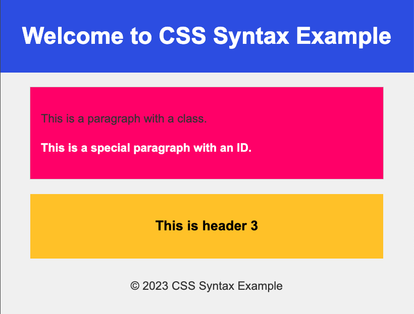

# YouTube - link

This repository contains a simple assignment aimed at enhancing your CSS skills. The task is to create an article with a yellow background color and centered text.

## Assignment

Your goal is to style an article with specific requirements:
- Set the background color of the article to yellow. for example 
- Center-align the text within the article.

Feel free to experiment and use your creativity to make the article visually appealing.

## Solution

To view the final solution, navigate to the "solution" folder. Before checking the solution, challenge yourself to implement the styling on your own. This exercise is designed to help you practice and reinforce your HTML and CSS skills.

Happy coding!