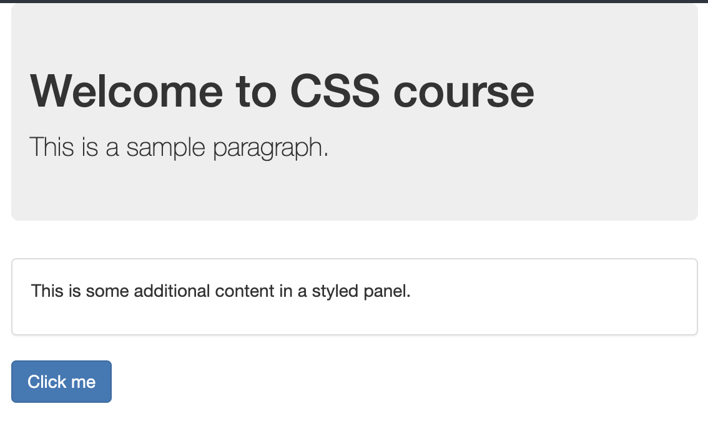

# YouTube - link

This repository contains a simple assignment aimed at enhancing your CSS skills. 

## Assignment

Your goal is to style welcome page with specific requirements:
- Set background color to header and change the font to be more dark.
-  Use boarder around the content
- Style the button with bluish color.

Feel free to experiment and use your creativity to make the page  visually appealing.

## Solution

To view the final solution, navigate to the "solution" folder. Before checking the solution, challenge yourself to implement the styling on your own. This exercise is designed to help you practice and reinforce your HTML and CSS skills.

Happy coding!